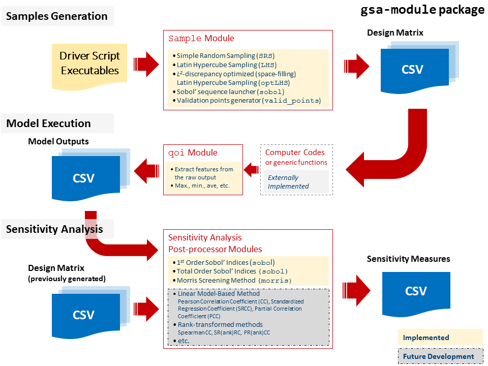

gsa-module
==========

``gsa-module`` is a Python3 package implementing several global sensitivity
analysis methods for computer/simulation experiments.
The implementation is based on a black-box approach where the computer model 
(or any generic function) is externally implemented to the module itself.
The module accepts the model outputs and the design of experiment (optional, 
only for certain methods) and compute the associated sensitivity measures.
The package also includes routines to generate normalized design of experiment 
file to be used in the simulation experiment based on several algorithms (such 
as simple random sampling or latin hypercube) as well as simple routines to 
post-processed multivariate raw code output such as its maximum, minimum, or
average. 

The general calculation flow chart involved in using the ``gsa-module`` can 
be seen in the figure below.

Main Features (v0.9.0)
----------------------

- Capability to generate design of computer experiments using 4 different
  methods: simple random sampling (srs), latin hypercube sampling (lhs),
  sobol' sequence, and optimized latin hypercube using either command line
  interface ``gsa_create_sample`` or the module API via ``import gsa_module``
- Sobol' quasi-random number sequence generator is natively implemented in
  Python3 based on C++ implementation of `Joe and Kuo (2008)`_.
- Randomization of the Sobol' quasi-random number using random shift procedure
- Optimization of the latin hypercube design is done via evolutionary
  stochastic algorithm (ESE)
- Generation of separate test points based on a given design using Hammersley
  quasi-random sequence
- Capability to generate design of computer experiments for screening analysis
  (One-at-a-time design), based on the trajectory design (original Morris)
  and radial design (Saltelli et al.)
- Capability to compute the statistics of elementary effects, standardized or
  otherwise both for trajectory and radial designs. The statistics (mean,
  mean of absolute, and standard deviation) are used as the basis of
  parameter importance ranking.
- Capability to estimate the first-order (main effect) Sobol' sensitivity
  indices using two different estimators (Saltelli and Janon).
- Capability to estimate the total effect Sobol' sensitivity indices using two
  different estimators (Sobol-Homma and Jansen).
- All estimated quantities are equipped with their bootstrap samples

Complete log of changes can be found in `CHANGELOG`_.

.. _Joe and Kuo (2008): http://web.maths.unsw.edu.au/~fkuo/sobol/
.. _CHANGELOG: ./CHANGELOG.md

Requirements
------------

The module was developed and tested using the `Anaconda Python`_ distribution
of Python v3.5.
No additional package except the base installation of the distribution is required.

.. _Anaconda Python: https://www.continuum.io/downloads

Installation
------------

``gsa-module`` is hosted on `BitBucket`_.

.. _BitBucket: https://bitbucket.org/lrs-uq/gsa-module

After cloning the source::

    git clone git@bitbucket.org:lrs-uq/gsa-module.git

the installation can be done easily from the local source directory::

    pip install -e .

This will make the following available in the path:

 - The python module ``gsa_module``
 - The executable ``gsa_create_sample``
 - The executable ``create_validset``
 - The executable ``gsa_morris_generate``
 - The executable ``gsa_morris_analyze``

Documentation
-------------

Documentation for ``gsa-module`` is an on-going process.
The current version can be found in the ``/docs`` folder and can be built
(given that ``sphinx`` has been installed) with the ``make`` command::

    make html

to build the html version of the documentation. The index file can then be
found in::

    ./docs/build/html/index.html

Contribute
----------

``gsa-module`` is hosted on a private repository on `BitBucket`_ under the
`Global Sensitivity Analysis`_ project.
Only those who is a team member of `lrs-uq`_ has write access.

- Issue Tracker: https://bitbucket.org/lrs-uq/gsa-module/issues
- Source Code: https://bitbucket.org/lrs-uq/gsa-module

.. _lrs-uq: https://bitbucket.org/lrs-uq
.. _Global Sensitivity Analysis: https://bitbucket.org/account/user/lrs-uq/projects/GSA

License
-------

The project is licensed under the MIT License.
