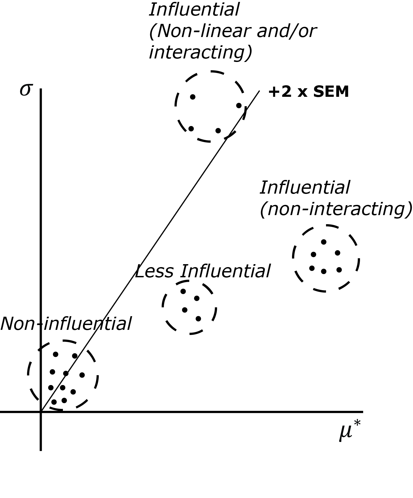
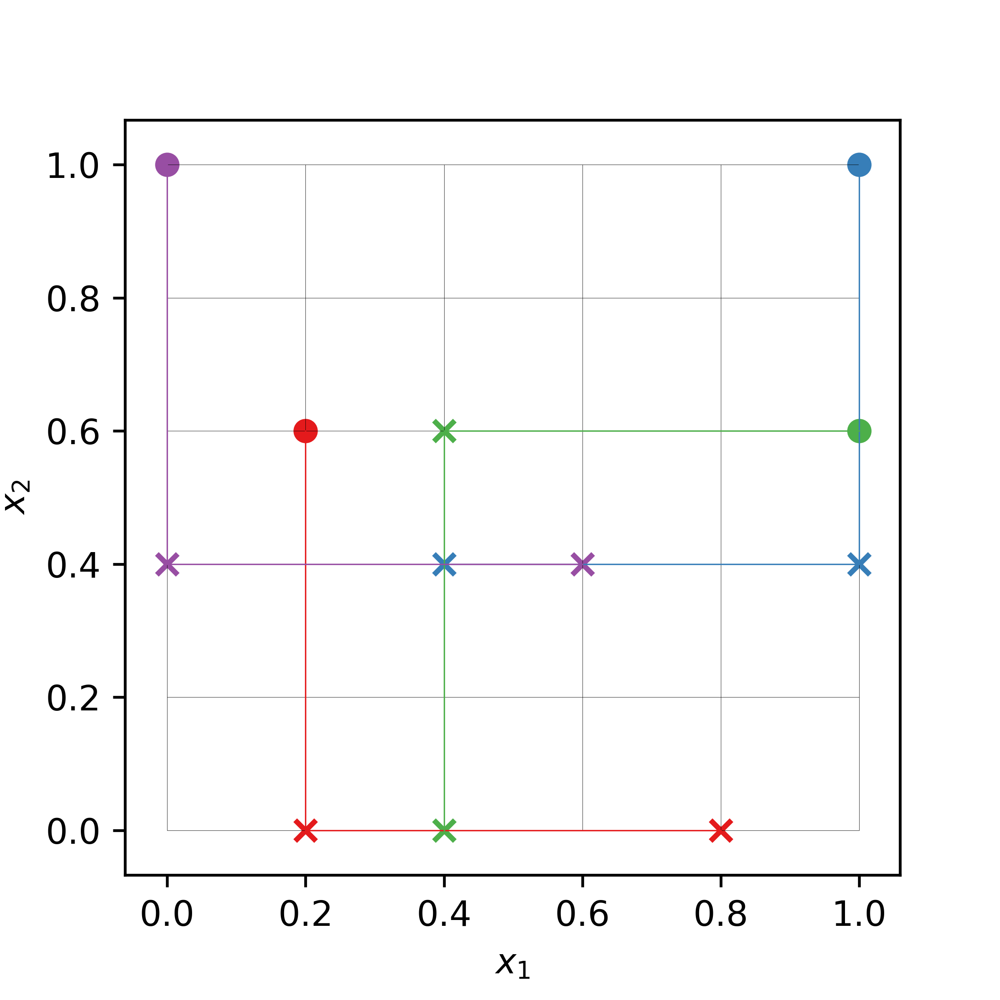
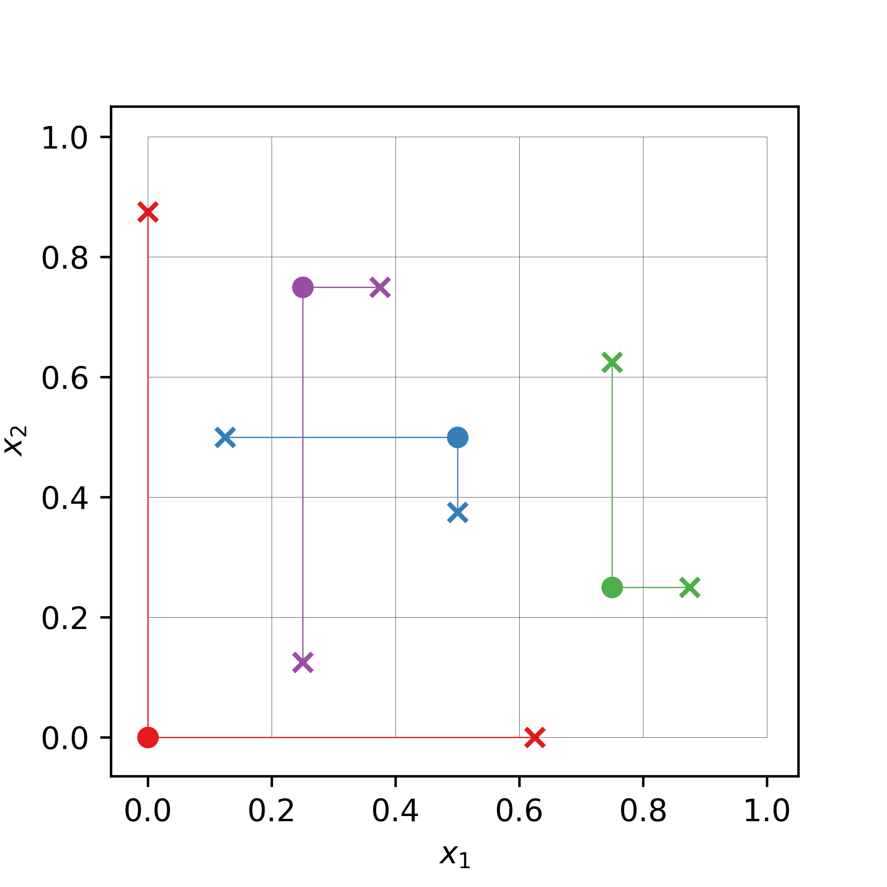
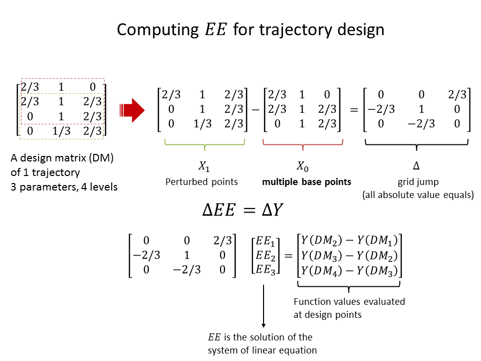
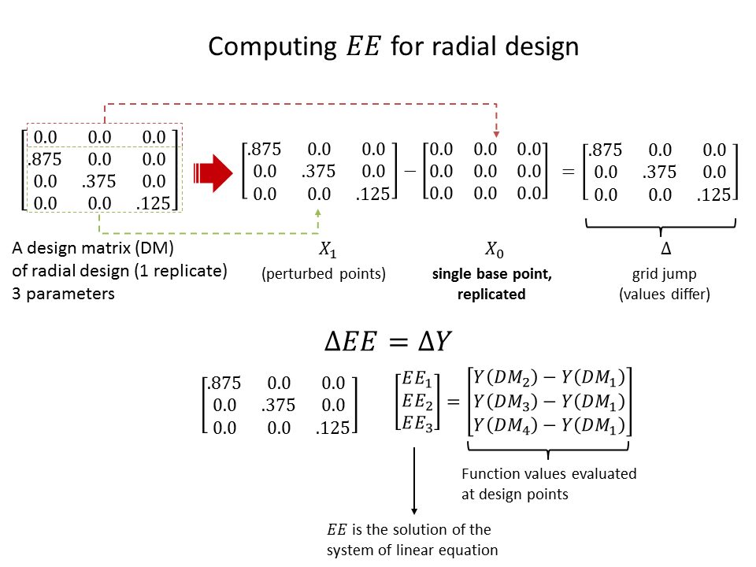

.. gsa_module_implementation_morris:

-----------------------
Morris Screening Method
-----------------------

Screening methods are used to rank the importance of the model parameters using
a relatively small number of model executions [1]_.
However, they tend to simply give qualitative measures.
That is, meaningful information resides in the rank itself but not in the
exact importance of the parameters with respect to the output.
These methods are particularly valuable in the early phase of a SA to
identify the non-influential parameters of a model, which then could be safely
excluded from further detailed analysis.
This exclusion step is important to reduce the size of the problem especially
if a more expensive method is to be applied at the next step.
In this work, attention was paid to a particular screening method proposed
by Morris [2]_.

Elementary Effects
------------------

Consider a model with :math:`K`, where :math:`\vec{x} = (x_1, x_2, . . ., x_K)`
is a vector of parameter value mapped onto the unit hypercube and
:math:`y(\vec{x})` is the model output evaluated at point :math:`\vec{x}`.
The elementary effect of parameter `k` is defined as follow [2]_ ,

:math:`EE_k = \frac{Y(x_1, x_2, \ldots, x_k + \Delta, \ldots, x_K)
- Y(x_1, x_2, \ldots, x_K)}{\Delta}`

Where :math:`\Delta`, the *grid jump*, is chosen such that :math:`\vec{x} + \Delta`
is still in the specified domain of parameter space; :math:`\Delta` is a value
in :math:`{\frac{1}{p-1}, \ldots, 1 - \frac{1}{p-1}}` where :math:`p`
is the number of levels that partitions the model parameter space into a
uniform grid of points at which the model can be evaluated.
The grid constructs a finite distribution of size :math:`p^{K-1} [p - \Delta(p-1)]`
elementary effects per input parameters.

The key idea of the original Morris method is in initiating the model
evaluations from various “nominal” points :math:`\vec{x}` randomly selected
over the grid and then gradually advancing one grid jump at a time between each
model evaluation (one at a time), along a different dimension of the parameter
space selected randomly.

Statistics of Elementary Effects and Sensitivity Measure
--------------------------------------------------------

Consider now that an :math:`n_R` number of elementary
effects (or *replicates*) associated with the k’th parameter have been sampled
from the finite distribution of :math:`EE_k`.
The statistical summary of :math:`EE_k` from the sampled trajectories can be
calculated.
The first is the arithmetic mean defined as,

:math:`\mu_k = \frac{1}{n_R} \Sigma^{n_R}_{r=1} EE^{r}_{k}`

The second statistical summary of interest is the standard
deviation of the elementary effect associated with the
k’th parameter from all the trajectories,

:math:`\sigma_k = \sqrt{\frac{1}{n_R}\Sigma^{n_R}_{r=1} (EE^{r}_{k} - \mu_k)^2}`

The standard deviation gives an indication of the
presence of nonlinearity and/or interactions between the
`k`’th parameter and other parameters.
As a change in a parameter value might have a changing
sign on the output and thus result in a cancelation
effect (as can be the case for a nonmonotonic function),
Campolongo et al. [4]_ proposed the use of the mean of the
absolute elementary effect to circumvent this issue. It is
defined as

:math:`\mu^{*}_k = \frac{1}{n_R} \Sigma^{n_R}_{r=1} |EE^{r}_{k}|`

The three aforementioned statistical summaries, when evaluated over a large
number of trajectories :math:`n_R`, can provide global sensitivity measures of
the importance of the k’th parameter.
As indicated by Morris [2]_ there are three possible categories of parameter
importance:

 1. Parameters with noninfluential effects, i.e., the parameters that have
    relatively small values of both :math:`\mu_k` (or :math:`\mu^{*}_k`) and
    :math:`\sigma_k`. The small values of both indicate that the parameter has
    a negligible overall effect on the model output.
 2. Parameters with linear and/or additive effects, i.e.,
    the parameters that have a relatively large value of :math:`\mu_k`
    (or :math:`\mu^{*}_k`) and relatively small value of :math:`\sigma_k`.
    The small value of :math:`\sigma_k` and the large value of :math:`\mu_k`
    (or :math:`\mu^{*}_k`) indicate that the variation of elementary effects is
    small while the magnitude of the effect itself is consistently large for
    the perturbations in the parameter space.
 3. Parameters with nonlinear and/or interaction effects, i.e., the parameters
    that have a relatively small value of :math:`\mu_k` (or :math:`\mu^{*}_k`)
    and a relatively large value of :math:`\sigma_k`. Opposite to the previous
    case, a small value of :math:`\mu_k` (or :math:`\mu^{*}_k`) indicates that
    the aggregate effect of perturbations is seemingly small while a large
    value of :math:`\sigma_k` indicates that the variation of the effect is
    large; the effect can be large or negligibly small depending on the other
    values of parameters at which the model is evaluated. Such large variation
    is a symptom of nonlinear effects and/or parameter interaction.

Such classification makes parameter importance ranking and, in turn, screening
of non-influential parameters possible.
However, the procedure is done rather qualitatively, and this is illustrated
in the figure below, which depicts a typical parameter classification derived
from visual inspection of the elementary effect statistics on the
:math:`\sigma_k` versus :math:`\mu^{*}_k` plane.



The notions of influential and noninfluential are based on the relative
locations of those statistics in the plane.
Typically, the noninfluential ones are clustered closer to the origin
(relative to the more influential ones) with a pronounced boundary such as
depicted in the figure.
Admittedly, if these statistics are spread uniformly across the plane,
the distinction would be more ambiguous (in this case, a more advanced classification
such as the ones based on clustering techniques might be
helpful).
Furthermore, for a parameter with large :math:`\mu_k` and :math:`\sigma_k`,
the method cannot distinguish between nonlinearity effects from parameter
interactions on the output.

Design of Experiment for Screening Analysis
-------------------------------------------

There are two available experimental designs for to carry out the Morris
screening method in ``gsa-module``: the trajectory design and radial OAT design.

Trajectory Design (*Winding Stairs*)
````````````````````````````````````

Trajectory design is the original Morris implementation of the design of
experiment for screening design [2]_. Essentially, it is a randomized
one-at-a-time design where each parameter is perturbed once, similar to that of
the *winding stairs* design proposed by Jansen et al. [3]_. The most important
feature of trajectory design is that it does not return to the original base
point after perturbation, but continue perturbing another dimension for the last
perturbed point. This ensures more efficient parameter space exploration
although requires additional user-defined parameter called *level* [4]_.

A trajectory design is defined by the number of trajectories (`r`),
the number of levels (`p`), and the number of model parameters (`k`).
Each trajectories evaluate the model `(k + 1)` times so the economy of it in
computing the elementary effects statistics is `r * (k+1)` code runs.

A randomized trajectory design matrix is given by :math:`b^*` ([2]_, [5]_),

.. math::

    b^* = (x^* + \frac{\Delta}{2} \times ((2 \times b - j_k) \times d^* + j_k))
    \times p^*

- :math:`b`: a strictly lower triangular matrix of 1s, with dimension of
  `(k + 1)-by-k`
- :math:`x^*`: Random starting point in the parameter space, with dimension of
  `(k + 1)-by-k`
- :math:`d^*`: a k-dimensional diagonal matrix which each element is either +1
  or -1 with equal probability. This matrix determines whether a parameter
  value will decrease or increase.
- :math:`p^*`: `k-by-k` random permutation matrix in which each row contains
  one element equal to 1, all others are 0, and no two columns have 1s in the
  same position. This matrix determines the order in which parameters are
  perturbed.
- :math:`j_k`: `(k + 1)-by-k` matrix of 1s
- :math:`\Delta`: factorial increment in a diagonal matrix of
  `(k + 1)-by-(k + 1)`

The following is an example of a trajectory design in 2-dimensional input space
with 4 trajectories (or *replicates*).
The input parameter space is uniformly divided into 6 levels.
The filled circles are the random base (nominal) points from which
the random perturbation of the same size (i.e., the grid jump) is
carried out one-at-a-time.



Radial Design
`````````````

Radial design is a design for screening analysis proposed in [4]_.
Similar to trajectory design it is based on an extension of one-at-a-time
design. In the implementation of [4]_, Sobol' quasi-random sequence is
used as the basis. Its main advantage over the trajectory design is
the specification of input discretization level by user is no longer required.
Furthermore, the grid jump will also be varying from one input dimension
to another, and from replicate to replicate incorporating additional
possible sources of variation in the method.

The procedure to generate radial design of `r` replicates is as follow:
 1. Generate Sobol' sequence with dimension `(r+R, 2*k)`. `R` is the shift
    to avoid repetition in the sequence (`R = 4` following [4]_).
 2. The first half of the matrix up to the `r`-th row will serve as the
    base points: :math:`a_i = (x_{i,1}, x_{i,2}, \ldots x_{i,k}) \; ; i = 1,\ldots r`.
    The second half of the matrix, starting from the `R+1`-th
    row will serve as the auxiliary points, from which the perturbed states
    of the base point are created: :math:`b_i = (x_{R+i,k+1}, x_{R+i,k+2}, \ldots x_{R+i,2k}) \; ; i = 1,\ldots r`
 3. For each row of the base points, create a set of perturbed states by
    substituting the value at each dimension by the value from the
    auxiliary points at the same dimension, one at a time.
    For each base point, there will be additional `k` perturbed points.
    For instance the 1st perturbed point of the `i`-th base point is,
    :math:`a^{*,1}_i = (x_{R+i,k+1}, x_{i,2}, \ldots x_{i,k})`, while
    the second is :math:`a^{*,2}_i = (x_{i,1}, x_{R+i,k+2}, \ldots x_{i,k})`.
    In general the `j`-th perturbed point of the `i`-th base point is,
    :math:`a^{*,j}_i = (x_{i,1}, \ldots x_{R+i,k+j}, \ldots x_{i,k})`
 4. A single elementary effect for each input dimension can be computed
    on the basis of function evaluations at `k+1` points:
    1 base point and `k` perturbed points.
 5. Repeat the process until the requested `r` replications have been
    constructed.

As such the radial design has the same economy as the trajectory design,
that is `r * (k+1)` computations for `k`-dimensional model with
`r` replications. The computation of the elementary effect :math:`EE_i`,
however, is slightly different due to the fact that now the grid jump
differs for each input dimension at each replication.

.. math::

    EE^{i}_j = \left|\frac{y(a^{*,j}_i) - y(a_i)}{x_{R+i,k+j} - x_{i,j}}\right|


- :math:`y(a^{*,j}_i)`: function value at `j`-th perturbed point of the `i`-th replicate.
- :math:`y(a_i)`: function value at the base point of the `i`-th replicate.
- :math:`x_{R+i,k+j}`: the perturbed input at dimension `j` of the `i`-th replicate.
- :math:`x_{i,j}`: the base input at dimension `j` of the `i`-th replicate.

As can be seen the average over many replications of the elementary effect
defined above will automatically yield :math:`\mu^*`.

The following is an example of a radial design in 2-dimensional input space
with 4 base points (filled circles), located not necessarily in a specific grid.
The perturbations are carried out from these base points (crosses).
The size of the perturbation differs from input dimension to input
dimension and from replicate to replicate.



Miscellaneous Topics
--------------------

Computation of the Elementary Effect
````````````````````````````````````

In ``gsa-module``, computing the elementary effect for each replications is
achieved by using matrix algebra, which is similar to the implementation in
[6]_. There is slight difference between the computation of elementary effects
for trajectory design and radial design.
The following figure illustrate the computation of all the elementary effects
of a single replicate for 3-parameter model using trajectory design with
4 levels.



The following figure illustrate the same computation of a single replicate for
3-parameter model using radial design (no number of levels specification
needed).



The statistics of the elementary effects are eventually computed
after the same procedure are repeated for many replications.

Presenting the Results of the Analysis
``````````````````````````````````````

Standardized Elementary Effect
``````````````````````````````

In the original implementation of Morris method [2]_, the input parameter
is normalized, that is all the parameters values lie between 0, 1.
Furthermore, following the suggestion by Saltelli et al. [5]_, the grid jump
size is kept constant for a given number of levels for all parameters.
As such, the method is prone to misrank the important parameters if there is
a vast difference in the original scale of various parameters
(e.g., [0,1] in one parameter, [10,100] in another, etc.).
The normalized scale of [0,1] would then be biased to the parameter who has
the largest scale of variation.
To compare the elementary effect in a common ground taking into account the
original scale of variation for each parameter, it is advised in [7]_ to scale
the elementary effect with the standard deviation of the input
:math:`\sigma_{x_i}` and of the output :math:`\sigma_y`,

.. math::

    SEE_i = \frac{\sigma_{x_i}}{\sigma_y} \frac{\Delta y}{\Delta x_i}

In ``gsa-module``, the standardized elementary effect is automatically computed
if the rescaled input parameters values are specified. It is used to compute
the standard deviation for each of the parameters taking into account the
original scale of variation of each.

Optimized Trajectory Design
```````````````````````````

References
----------

.. [1] A. Saltelli et al., "Sensitivity Analysis in Practice: A Guide to
       Assessing Scientific Models," John Wiley & Sons, Ltd. United Kingdom
       (2004).
.. [2] Max D. Morris, "Factorial Sampling Plans for Preliminary Computational
       Experiments", Technometrics, Vol. 33, No. 2, pp. 161-174, 1991.
.. [3] Michiel J.W. Jansen, Walter A.H. Rossing, and Richard A. Daamen, "Monte
       Carlo Estimation of Uncertainty Contributions from Several Independent
       Multivariate Sources," in Predictability and Nonlinear Modelling in
       Natural Sciences and Economics, Dordrecht, Germany, Kluwer Publishing,
       1994, pp. 334 - 343.
.. [4] F. Campolongo, A. Saltelli, and J. Cariboni, "From Screening to
       Quantitative Sensitivity Analysis. A Unified Approach," Computer Physics
       Communications, Vol. 192, pp. 978 - 988, 2011.
.. [5] A. Saltelli et al., "Global Sensitivity Analysis. The Primer," West
       Sussex, John Wiley & Sons, 2008, pp. 114
.. [6] Jon D. Herman, SALib [Source Code], March 2014, https://github.com/jdherman/SALib
.. [7] G. Sin and K. V. Gernaey, "Improving the Morris Method for Sensitivity
       Analysis by Scaling the Elementary Effects," in Proc. 19th European
       Symposium on Computer Aided Process Engineering, 2009
