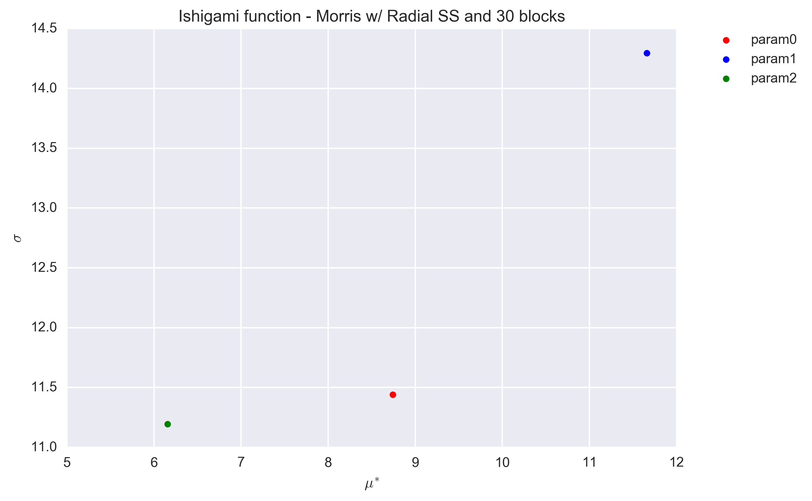
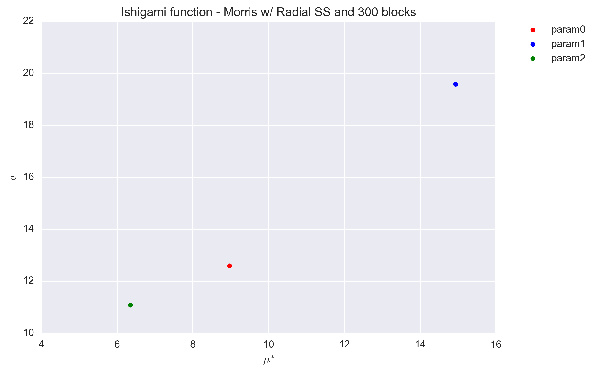
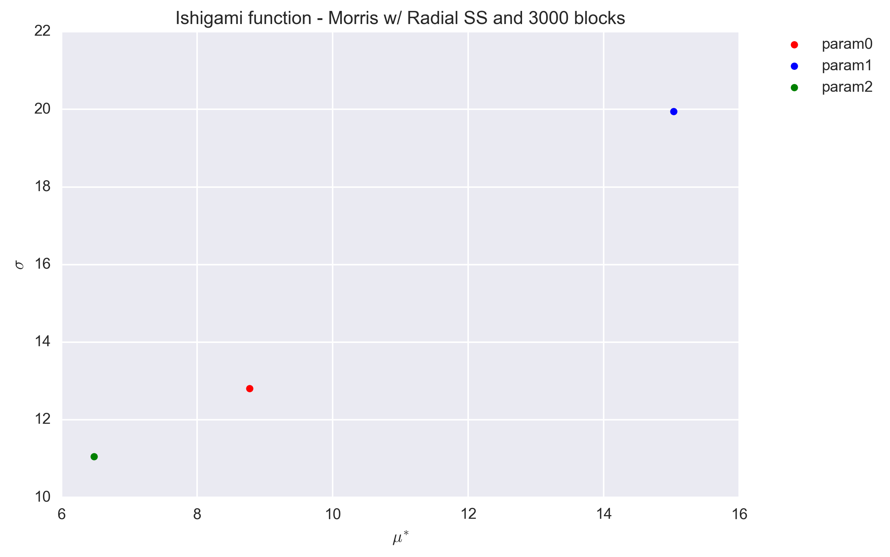
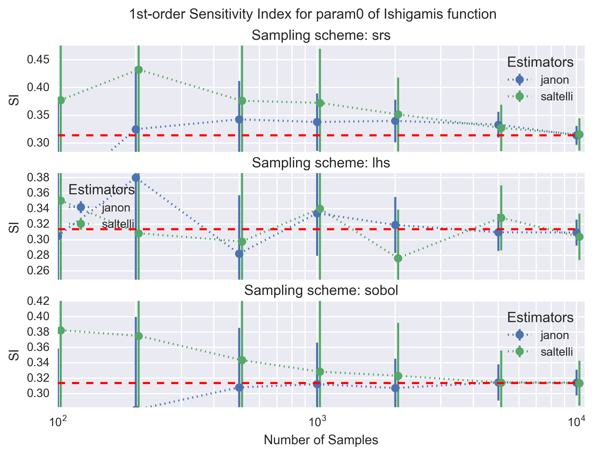
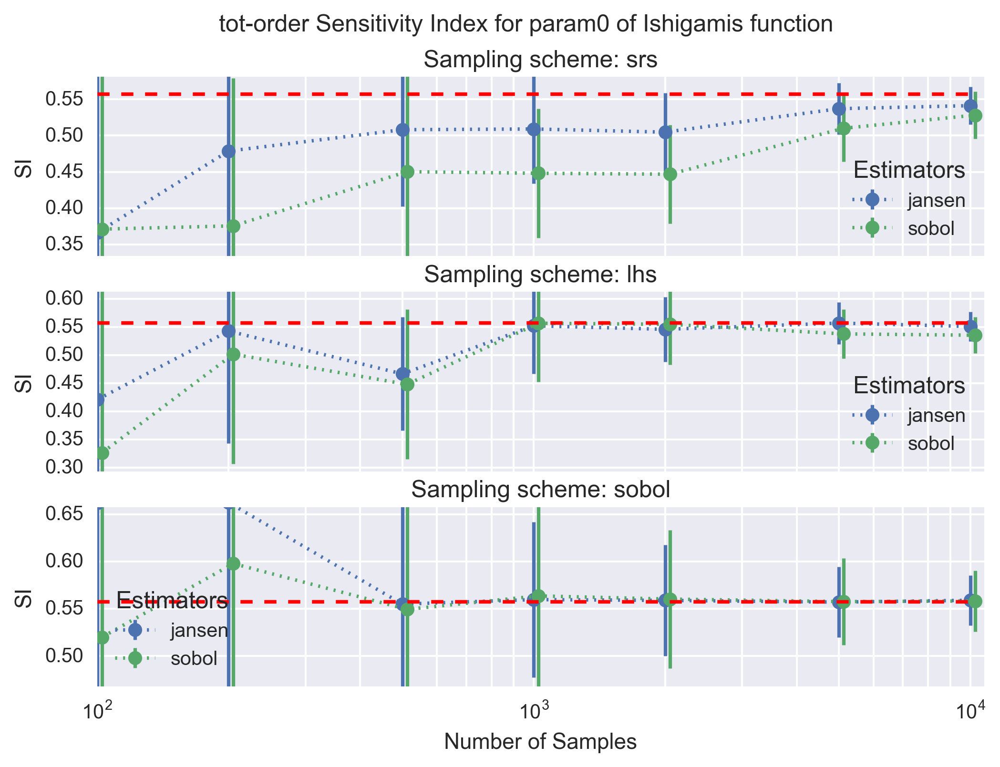

-----------------
Ishigami Function
-----------------

Ishigami function is a 3-dimensional function introduced by Ishigami and Homma
[1]_,

.. math::

    f(\mathbf{x}) = \sin x_1 + a \sin^2 x_2 + b x^4_3 \sin x_1

.. math::
    x_d \sim U[-\pi, \pi]; d = 1, 2, 3

the parameters `a` and `b` can be adjusted but have default values of 7 and 0.1, respectively.

Analytical Solution
-------------------

The analytical formulas for the variance terms of the Ishigami function
for :math:`\mathbf{X}_d \sim \mathcal{U}[-\pi,\pi]; \, d = 1, 2, 3`
and the given parameter :math:`a` and :math:`b` are the following

**Marginal Variance**

.. math::
    \mathbb{V}[Y] = \frac{a^2}{8} + \frac{b \pi^4}{5} + \frac{b^2 \pi^8}{18} + \frac{1}{2}

**Top Marginal Variance**

.. math::
    V_1 & = \mathbb{V}_{1} [\mathbb{E}_{2,3} [Y | X_1]] & = \frac{1}{2} \left(1 + \frac{b \pi^4}{5}\right)^2 \\
    V_2 & = \mathbb{V}_{2} [\mathbb{E}_{1,3} [Y | X_2]] & = \frac{a^2}{8} \\
    V_3 & = \mathbb{V}_{3} [\mathbb{E}_{1,2} [Y | X_3]] & = 0

**Bottom Marginal Variance**

.. math::
    VT_1 = \mathbb{E}_{2,3} [\mathbb{V}_{1} [Y | \mathbf{X}_2,\mathbf{X}_3]] & = \frac{1}{2} \left(1 + \frac{b \pi^4}{5}\right)^2 + \frac{8 b^2 \pi^8}{225}\\
    VT_2 = \mathbb{E}_{1,3} [\mathbb{V}_{2} [Y | \mathbf{X}_1,\mathbf{X}_3]] & = \frac{a^2}{8} \\
    VT_3 = \mathbb{E}_{1,2} [\mathbb{V}_{3} [Y | \mathbf{X}_1,\mathbf{X}_2]] & = \frac{8 b^2 \pi^8}{225}

The analytical main- and total-effect sensitivity indices can be computed using their respective definition in relation to the variance terms given above.

Morris Screening Results
------------------------

The function was used to test the implementation of the Morris screening and
most precisely that of the two designs of experiment: the trajectory and radial
designs (see :doc:`../implementation/morris_screening_method`).

.. _sec_ishigami_trajectory:

Trajectory sampling design
==========================

The trajectory effect is the original design proposed by Morris. The design
matrix was generated with:

- number of trajectories (`r`) equal to 10, 100 and 1000 times the number of
  parameter (`k=3`),
- and levels (`p`) equal to 4, 8, 12 and 20.

Each generated design was used to evaluate the Morris modified function and the
associated elementary effects were calculated.

The following figures show the :math:`\sigma` vs. :math:`\mu^*` plot for the
four parameters of the Ishigami function for different sets of `r` and `p`
values. Each set of (`r`, `p`) value was repeated 1000 times and a histogram of
the results is presented for each parameter in the figures.

.. image:: ../../figures/MustarSigma_Ishigami_trajectory_30_plevels_4_1000_repet.png
.. image:: ../../figures/MustarSigma_Ishigami_trajectory_30_plevels_20_1000_repet.png
.. image:: ../../figures/MustarSigma_Ishigami_trajectory_300_plevels_4_1000_repet.png
.. image:: ../../figures/MustarSigma_Ishigami_trajectory_300_plevels_20_1000_repet.png

Countrary to the :doc:`morris_modified`, the value of
the elementary design with a level `p=4` is quite different that the values
obtained with the other level values. This remains true for a very large number
of trajectories (i.e. 3000). The predictions with a level of 8 or higher are
consistent.

We also observe that a number of trajectories equals to 10 times the number of
parameter (i.e. 30) is not sufficient to entirely classified the parameters (as
the histograms of parameters 0 and 2 overlap). A minimum number of trajectories
of about 100 times the number of parameter is necessary for the Ishigami
function to separate the parameters.

.. _sec_ishigami_radial:

Radial sampling design
==========================

The radial sampling design has been proposed by Campagnolo et al. and is
described in more details at :doc:`../implementation/morris_screening_method`.
Only a number of trajectories, here called blocks to differentiate from the
previous design, is required. For testing purposes we investigated, as
previously, numbers of blocks (`r`) equal to 10, 100 and 1000 times the number
of parameter (`k=3`).

Each generated design was used to evaluate the Ishigami function and the
associated elementary effects were calculated.

The following figures show the :math:`\sigma` vs. :math:`\mu^*` plot for the
three parameters of the Ishigami function and for the three sets of `r` values.
Countrary to the trajectory design, the radial design uses the Sobol generator,
which is deterministic. As such no repetitions were performed to investigate the
dispersion of the (:math:`\sigma`, :math:`\mu^*`) values.

The values are found to be quite stable, even for a block value of `r=30`. They
differ, however, significantly from that obtained with the trajectory design
(Section :ref:`sec_ishigami_trajectory`).

The exact value for the elementary effects were not found in litterature.
However, the sensitivity indices are :math:`S_1=0.3138`, :math:`S_2=0.4424` and
:math:`S_3=0` [1]_. Because :math:`\mu^*` and `S` quantify the same
information, we expect them to be ordered in the same way. Therefore the
results obtained with the radial sampling design appear preferable.

Sobol Sensitivity Indices Results
----------------------------------

The function was used to test the implementation of the Sobol sensitivity
indices. The main-effect (first order) and total-effect (total order)
sensitivity indices are both computed. Both the sampling scheme type and the
estimator for the sensitivity indices were tested. The tested sampling schemes
are simple random sampling (`srs`), latin-hypercube sampling (`lhs`) and the
sobol sampling (`sobol`). The tested estimators are `janon` and `saltelli` for
the main-effect `SI` and `jansen` and `sobol` for the total-effect `SI` (see
:doc:`../implementation/sobol_indices`).

The following figure shows the convergence of the main-effect `SI` (first
order) with the number of samples for the first parameter (`param0`) of the
Ishigami's function. Each panel shows the `janon` and `saltelli` estimators,
with their :math:`1-\sigma` uncertainties, for a given sampling scheme. The
dotted red line is the analytical solution (i.e. the target value).

A similar figure is shown below for the total-effect `SI` (tot-order) for the
`jansen` and `sobol` estimators.

All estimators for the main- and total-effect `SI` converge to the analytical
solution with a sufficient number of samples (i.e. :math:`10^4` in the worst
case). As expected the `sobol` and `lhs` sampling schemes for the design matrix
are clearly superior to the simple random scheme (`srs`) as the calculated
main- and total-effect `SI` converge faster and with a lower uncertainies; the
`sobol` sampling scheme appears to be only slightly better than `lhs`. Finally,
comparing the estimators the `janon` and `jansen` estimators show slightly
better properties than the `saltelli` and `sobol` estimators. These conclusions
remain the same for all input parameter of the Ishigami's function.

From a practical point of view, we advise to use the `sobol` or `lhs` sampling
scheme with at least `1000` points. The estimator does not play a significant
role.

References
----------

.. [1] T. Homma and A. Saltelli, "Importance measures in global sensitivity
       analysis of nonlinear models," Reliability Engineering and System
       Safety, vol. 52, pp. 1-17, 1996.
.. [2] A. Saltelli et al., "Sensitivity Analysis in Practice," John Wiley
       & Sons: West Sussex, 2004, pp. 196
