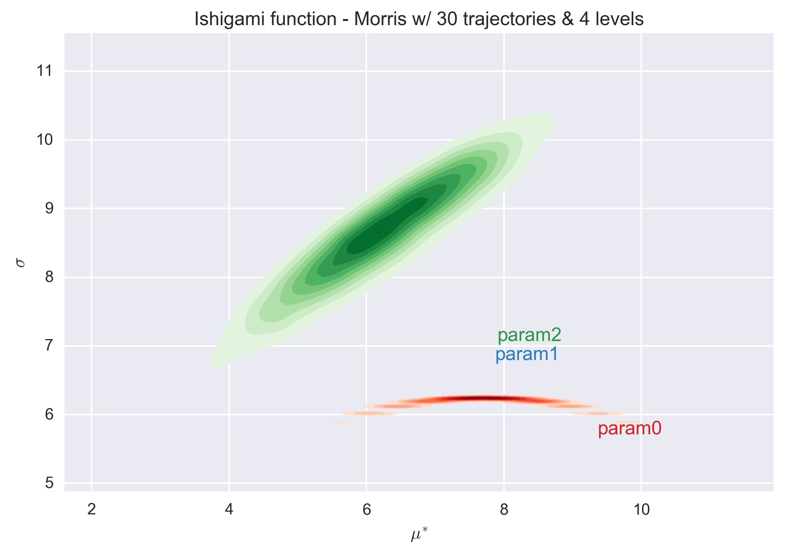
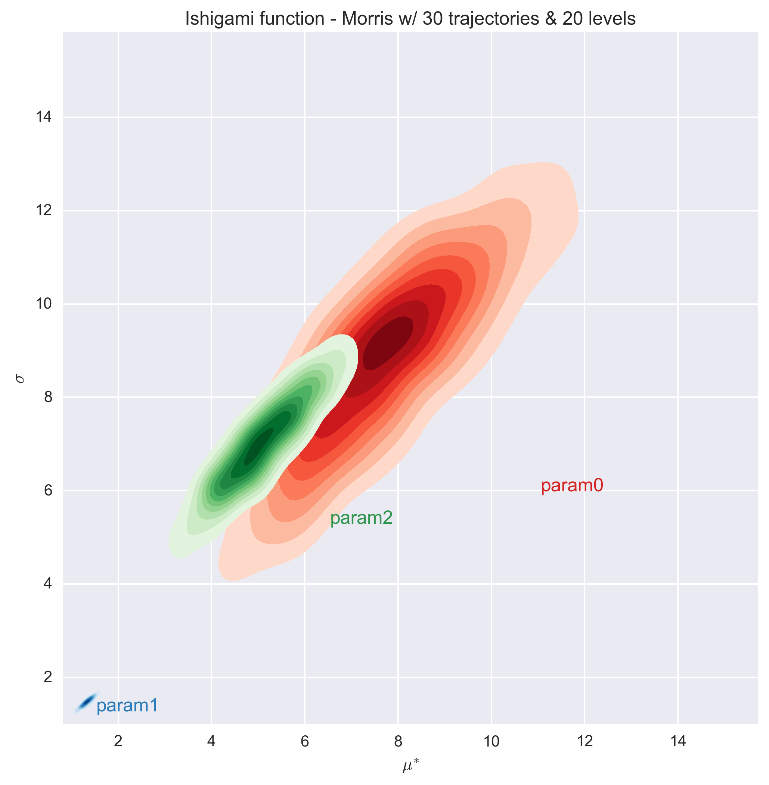
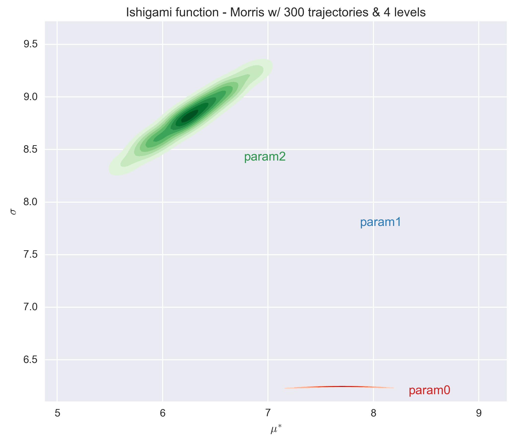
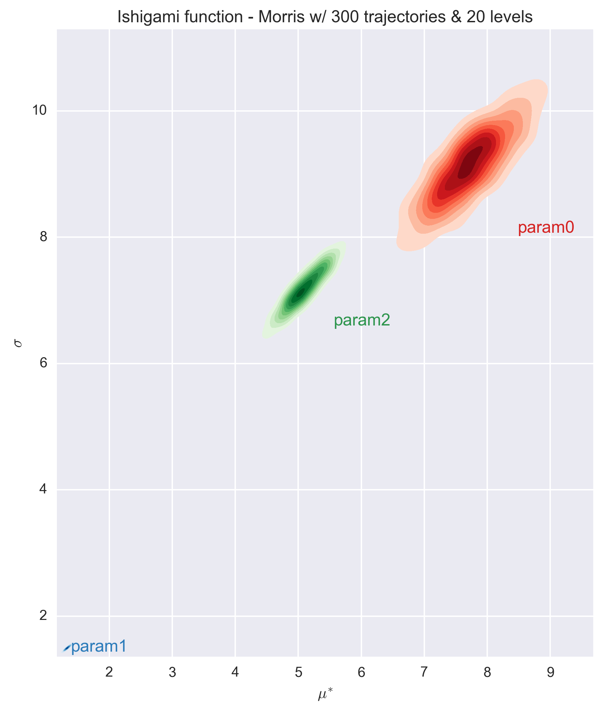

-----------------
Ishigami Function
-----------------

Ishigami function is a 3-dimensional function introduce by Ishigami and Homma
[1]_,

.. math::

    f(\underline x) = \sin x_1 + a \sin^2 x_2 + b x^4_3 \sin x_1

.. math::
    x_i \sim U[-\pi, \pi]; i = 1, 2, 3

Implementation in Python3
-------------------------

Morris Screening Results
------------------------

The function was used to test the implementation of the Morris screening and
most precisely that of the two designs of experiment: the trajectory and radial
designs :doc:`../implementation/morris_screening_method`.

The trajectory effect is the original design proposed by Morris. The design
matrix was generated with: 

- number of trajectories (`r`) equal to 10, 100 and 1000 times the number of
  parameter (`k=4`), 
- and levels (`p`) equal to 4, 8, 12 and 20.

Each generated design was used to evaluate the Morris modified function and the
associated elementary effects were calculated.

The following figures show the :math:`\sigma` vs. :math:`\mu^*` plot for the
four parameters of the Morris modified function for different sets of `r` and
`p` values. Each set of (`r`, `p`) value was repeated 1000 times and a
histogram of the results is presented for each parameter in the figures.

Countrary to the Morris Modified function :doc:`morris_modified`, the value of
the elementary design is incorrect with a level `p=4`. This remains true for a
very large number of trajectories (i.e. 3000). The predictions with a level of
8 or higher are consistent. Finally, we observe that a number of trajectories
equals to 10 times the number of parameter (i.e. 30) is not sufficient to
entirely classified the parameters (as the histograms of parameters 0 and 2
overlap). A minimum number of trajectories of about 100 times the number of
parameter is necessary for the Ishigami function.

References
----------

.. [1] T. Homma and A. Saltelli, "Importance measures in global sensitivity
       analysis of nonlinear models," Reliability Engineering and System
       Safety, vol. 52, pp. 1-17, 1996.
.. [2] A. Saltelli et al., "Sensitivity Analysis in Practice," John Wiley
       & Sons: West Sussex, 2004, pp. 196
