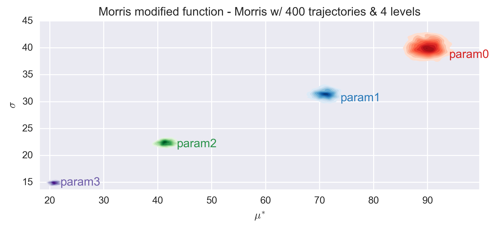
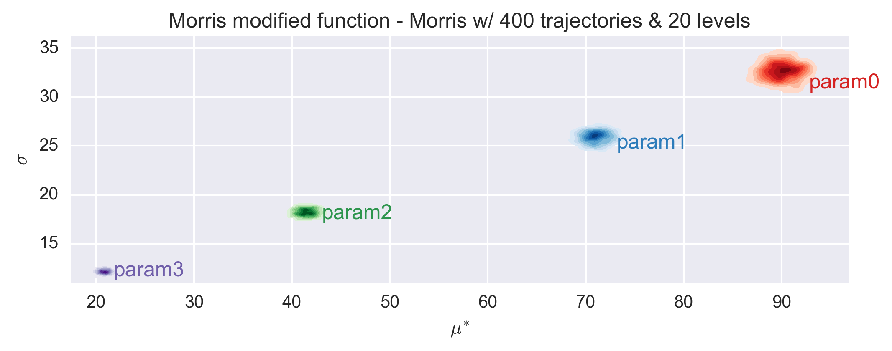
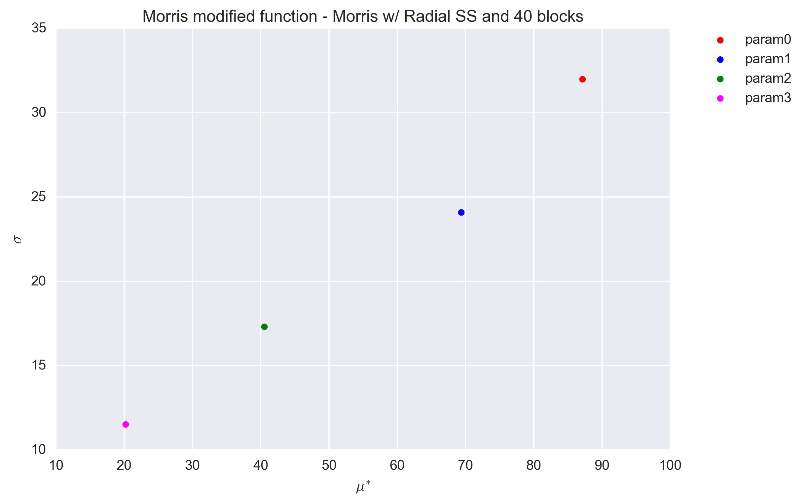
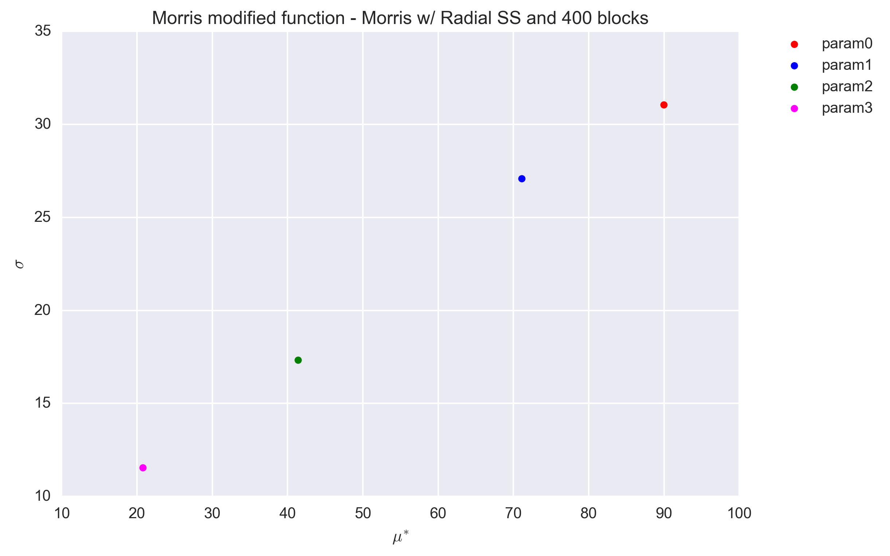
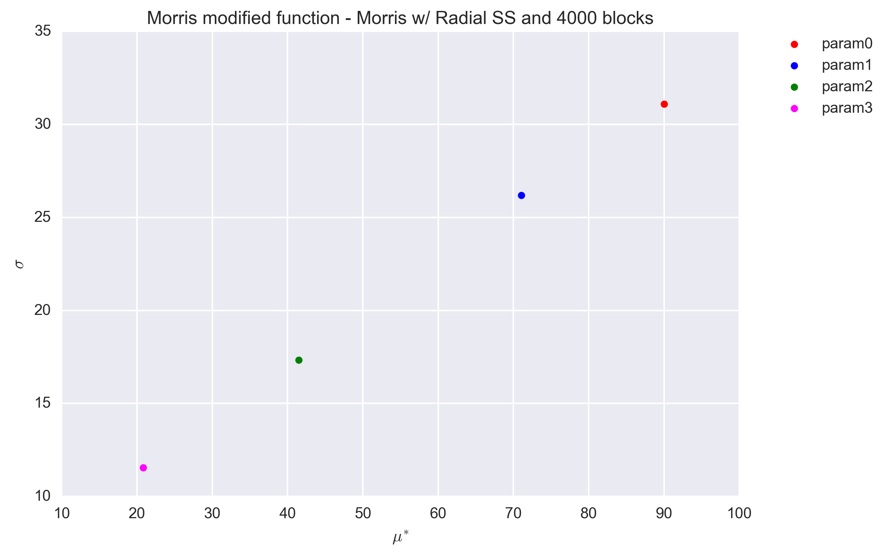

------------------------
Modified Morris Function
------------------------

A modified version of test function appeared in Morris' original article [1]_
is used as a test function in this module. Instead of 20-dimensional function,
the modified version is only 4-dimensional and truncated as follows,

.. math::

    f(\underline x) = \sum_{i=1}^{4} \beta_i x_i + \sum_{i\leq j}^4 \beta_{i,j} x_i x_j

.. math::

    \beta_i = \left[ 0.05, 0.59, 10.0, 0.21 \right ]

.. math::

    \beta_{i,j} = \left [\begin{matrix}
        0 & 80 & 60   & 40 \\
        0 & 30 & 0.73 & 0.18 \\
        0 & 0  & 0.64 & 0.93 \\
        0 &  0 & 0.0  & 0.06
    \end{matrix} \right ]

The function accepts inputs :math:`\underline x` the component of which are
:math: `0 < x_i \leq 1`.

Morris Screening Results
------------------------

The function was used to test the implementation of the Morris screening and
most precisely that of the two designs of experiment: the trajectory and radial
designs :doc:`../implementation/morris_screening_method`.

.. _sec_morrismod_trajectory:

Trajectory sampling design
==========================

The trajectory effect is the original design proposed by Morris. The design
matrix was generated with: 

- number of trajectories (`r`) equal to 10, 100 and 1000 times the number of
  parameter (`k=4`), 
- and levels (`p`) equal to 4, 8, 12 and 20.

Each generated design was used to evaluate the Morris modified function and the
associated elementary effects were calculated.

The following figures show the :math:`\sigma` vs. :math:`\mu^*` plot for the
four parameters of the Morris modified function for different sets of `r` and
`p` values. Each set of (`r`, `p`) value was repeated 1000 times and a
histogram of the results is presented for each parameter in the figures.

.. image:: ../../figures/MustarSigma_MorrisMod_trajectory_40_plevels_4_1000_repet.png
.. image:: ../../figures/MustarSigma_MorrisMod_trajectory_40_plevels_20_1000_repet.png

The elementary effects of the function are similar for all combinations of `r`
and `p` values and consistent with the expected values. As expected, the
histogram dispersion is reduced when the number of trajectories increases. The
classification of the parameters is stable already for an number of
trajectories equals to 10 times the nubmer of dimension.

.. _sec_morrismod_radial:

Radial sampling design
==========================

The radial sampling design has been proposed by Campagnolo et al. and is
described in more details at :doc:`../implementation/morris_screening_method`.
Only a number of trajectories, here called blocks to differentiate from the
previous design, is required. For testing purposes we investigated, as
previously, numbers of blocks (`r`) equal to 10, 100 and 1000 times the number
of parameter (`k=4`).

Each generated design was used to evaluate the Morris modified function and the
associated elementary effects were calculated.

The following figures show the :math:`\sigma` vs. :math:`\mu^*` plot for the
four parameters of the Morris modified function and for the three sets of `r`
values.  Countrary to the trajectory design, the radial design uses the Sobol
generator, which is deterministic. As such no repetitions were performed to
investigate the dispersion of the (:math:`\sigma`, :math:`\mu^*`) values.

The values are found to be quite stable, even for a block value of `r=40` and
are in agreement with that obtained with the trajectory design
(Section :ref:`sec_morrismod_trajectory`). A better quanitification of the
convergence to the reference values of :math:`\sigma`, :math:`\mu^*` is shown
in the table below. The only possible exception is for :math:`\sigma` of
parameter 1 (:math:`x_2`).

=========  ==============  =====  ======  ======  ======
Parameter  Statistics      Ref    r=40    r=400   r=4000
=========  ==============  =====  ======  ======  ======
Param0     :math:`\mu^*`   90.05  87.11   89.97   90.02
Param0     :math:`\sigma`  31.08  31.99   31.05   31.09
Param1     :math:`\mu^*`   71.05  69.36   71.11   71.06
Param1     :math:`\sigma`  28.86  24.10   27.09   26.18
Param2     :math:`\mu^*`   41.47  40.50   41.38   41.47
Param2     :math:`\sigma`  17.75  17.31   17.33   17.33
Param3     :math:`\mu^*`   20.83  20.19   20.76   20.82
Param3     :math:`\sigma`  11.54  11.53   11.55   11.55
=========  ==============  =====  ======  ======  ======

References
----------

.. [1] Max D. Morris, "Factorial Sampling Plan for Preliminary Computational
       Experiments," Technometrics, vol. 33, no. 2, pp. 161 - 174, 1991.
