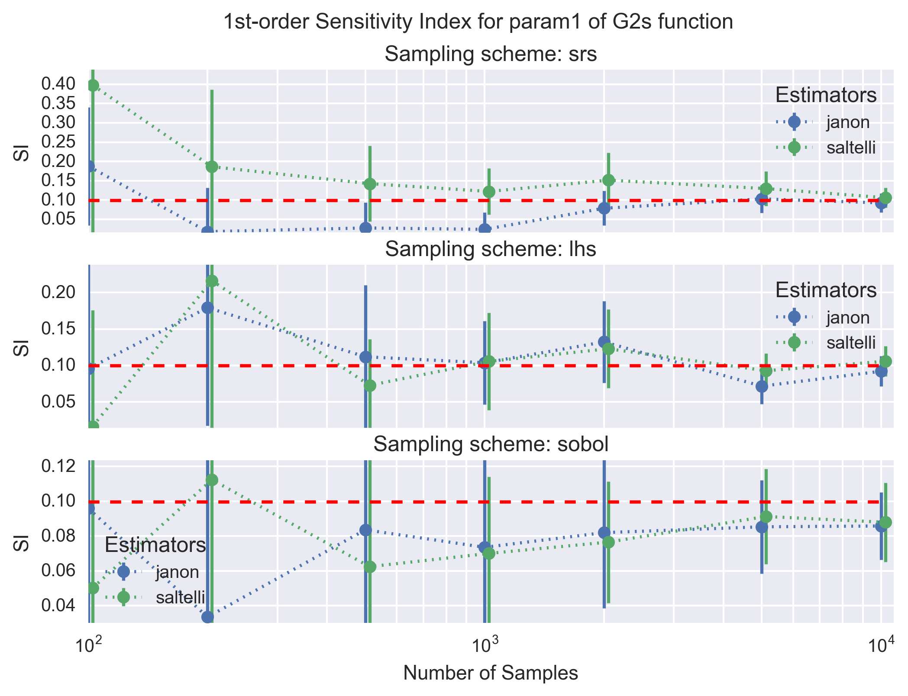
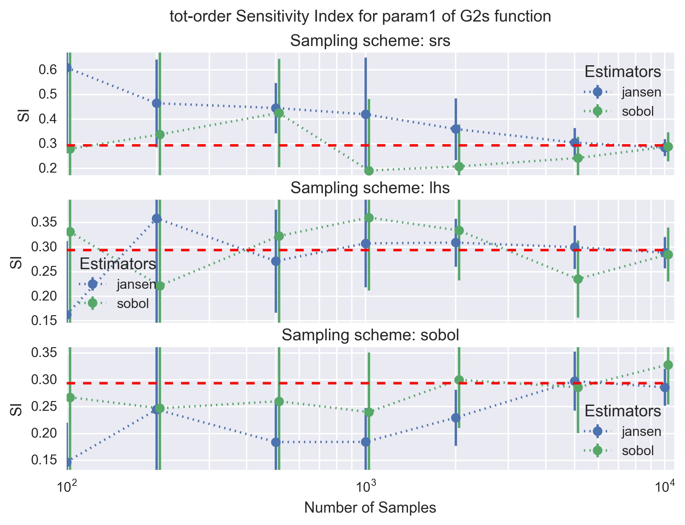

--------------------------
Sobol-:math:`G^*` Function
--------------------------

Sobol-:math:`G^*` is a modified version of Sobol-G function proposed in [1]_
initially to avoid excluding singular value at :math:`\mathbf{x}=\{0.5\}`.
The function reads,

.. math::
    & G^* (\mathbf{x}, \mathbf{a}, \boldsymbol{\alpha}, \boldsymbol{\delta}) = \prod_{d=1}^D g_i^* \\
    & g_d^* = \frac{(1 + \alpha_d) \cdot |2 (x_d + \delta_d - I[x_d + \delta_d]) - 1|^\alpha_d + a_d}{1 + a_d}

where :math:`\mathbf{x} \in [0,1]^D`;
:math:`a_d \in \mathbb{R}^+` determines the first-order importance of parameter-:math:`d`;
:math:`\delta \in [0,1]^D` is the shift parameter;
:math:`\boldsymbol{\alpha} \in \mathbb{R}^{D+}` is the curvature parameter;
and :math:`I[\circ]` is the integer part of the number.

The parameters :math:`\mathbf{a}` and :math:`\mathbf{\alpha}` can be adjusted.
The particular test function used in this module is :math:`G_2^*` (see pp. 265 in [1]_) where

.. math::
    & \alpha_d = 1; \, d = 1, 2, \cdots, 10 \\
    & a_d = (0, 0.1, 0.2, 0.3, 0.4, 0.8, 1, 2, 3, 4) \\
    & \delta_d \sim \mathcal{U}[0,1]; \, d = 1, 2, \cdots, 10

Analytical Solution
-------------------

The analytical formulas for the variance terms of the Sobol-:math:`G^*` function
for :math:`\mathbf{X}_d \sim \mathcal{U}[0,1]; \, d = 1, 2, \cdots, 10` are the following

**Marginal Variance**

.. math::
    \mathbb{V}[G_2^*] = \left[\prod_{d=1}^D (1 + V_d)\right] - 1

where :math:`V_d` is the top marginal variance given below,

**Top Marginal Variance**

.. math::
    V_d = \mathbb{V}_{d} [\mathbb{E}_{\sim d} [G_2^*| X_d]] = \frac{\alpha_d^2}{(1 + 2 \alpha_d)(1 + a_d)^2}

**Bottom Marginal Variance**

.. math::
    VT_d = \mathbb{E}_{\sim d} [\mathbb{V}_{d} [G_2^* | \mathbf{X}_{\sim d}]] = V_d \prod_{e \neq d} (1 + V_e)

The analytical main- and total-effect sensitivity indices can be computed using their respective definition in relation to the variance terms given above.

Sobol Sensitivity Indices Results
----------------------------------

The function was used to test the implementation of the Sobol sensitivity
indices. The main-effect (first order) and total-effect (total order)
sensitivity indices are both computed. Both the sampling scheme type and the
estimator for the sensitivity indices were tested. The tested sampling schemes
are simple random sampling (`srs`), latin-hypercube sampling (`lhs`) and the
sobol sampling (`sobol`). The tested estimators are `janon` and `saltelli` for
the main-effect `SI` and `jansen` and `sobol` for the total-effect `SI` (see
:doc:`../implementation/sobol_indices`).

The following figure shows the convergence of the main-effect `SI` (first
order) with the number of samples for the second parameter (`param1`) of the
:math:`G_2` function. Each panel shows the `janon` and `saltelli` estimators,
with their :math:`1-\sigma` uncertainties, for a given sampling scheme. The
dotted red line is the analytical solution (i.e. the target value).

A similar figure is shown below for the total-effect `SI` (tot-order) for the
`jansen` and `sobol` estimators.

All estimators for the main- and total-effect `SI` converge to the analytical
solution with a sufficient number of samples (i.e. :math:`10^4` in the worst
case). As expected the `sobol` and `lhs` sampling schemes for the design matrix
are clearly superior to the simple random scheme (`srs`) as the calculated
main- and total-effect `SI` converge faster and with a lower uncertainies; the
`sobol` sampling scheme appears to be slightly better than `lhs`. Finally,
comparing the estimators the `janon` and `jansen` estimators show slightly
better properties than the `saltelli` and `sobol` estimators. The better
properties of the estimators and sampling schemes illustrated for `param1` can
vary slightly from parameter to parameter. The convergence of the calculation,
however, remains. This confirms the good implementation of the `SI` calculation
routines.

References
----------

.. [1] A. Saltelli et al.,
       "Variance based sensitivity analysis of model output. Design and estimator for the total sensitivity index,"
       Computer Physics Communication, vol. 181, no. 2, pp. 259 - 270, 2010.
